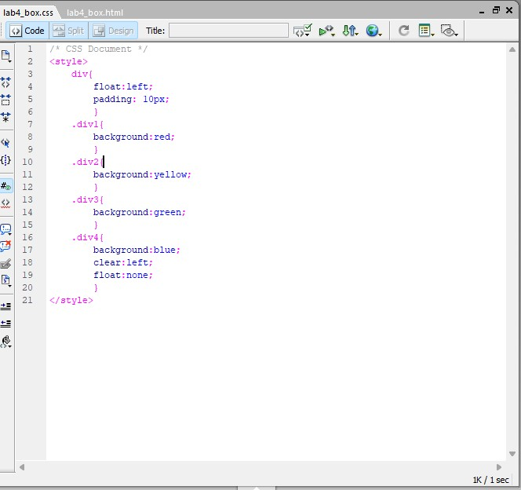
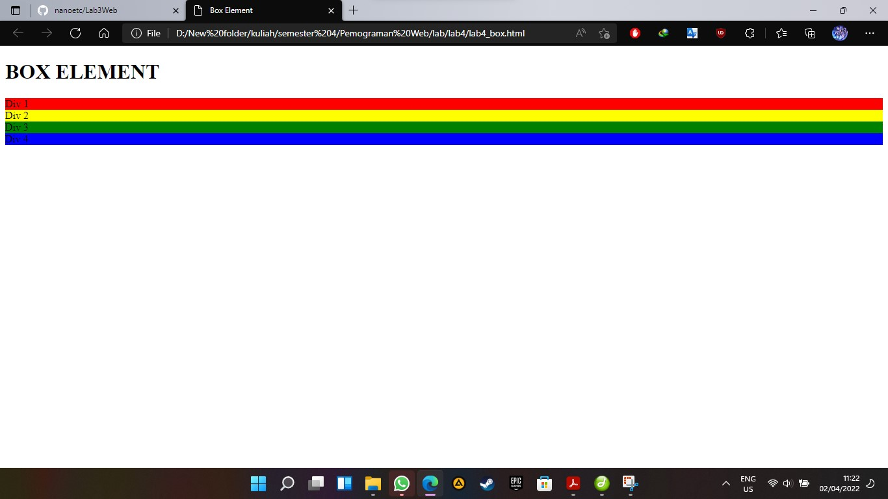

# lab4Web
# bagus tri handono - 312010170
# 20.TI.B1
==========================================================================================================
disini saya akan mempelajari tentang membuat box element dan css layout sederhana 

link untuk membuat box HTML=>[element box HTML](box/lab4_box.html) 
link untuk CSS box HTML=>[element box css](box/lab4_box.css) 
link untuk membuat layout sederhana HTML=>[layout sederhana HMTL](layout/home.html) 
link untuk membuat CSS layout sederhana=>[layout sederhana CSS](layout/style.css) 

1. membuat box html bisa dilihat pada gambar dibawah ini 
 
gambar diatas adalah untuk HTML  
 
gambar diatasadalah untuk CSS 
2. lalu kita buka dibrowser maka akan terlihat seperti dibawah ini 
 
 
setelah selesai mari kita coba membuat layout sederhana pada HTML 
 pertama mari kita buat kerangkanya dahulu 
 
 lalu kemudian kita tambahkan CSS seperti gambar dibawah disini 
 
 jika sudah mari kita buka pada browser maka akan terlihat seperti gamabar dibawah ini 
 
 setelah itu mari kita buat navigasi pada CSS 
 
 jika sudah mari refresh browser maka akan tampak seperti dibawah ini 
 
 mari kita buat Hero panel pada CSS 
 
 refresh browser dan liat perubahannya 
 
 mari kita buat sidebar Widget box 
 
 tambahkan juga pada file CSS 
 
 refresh browser dan liat perubahannya 
 
 kita buat footer 
 
 refresh browser dan liat perubahannya 
 
 kita buat main conten  
 
 tambahkan pada CSS juga  
 
 refresh browser dan liat perubahannya 
 
 mari kita tambahkan article 
 
 jangan lupa tambahkan pada CSS juga 
 \
 refresh browser dan liat perubahannya 
 
 
Pertanyaan dan Tugas 
1. Tambahkan Layout untuk menu About 
=> buat single layout yang berisi deskripsi, portfolio, dll 
jawab= [file menu about HTML](layout/about.html),[file menu about CSS](layout/style_about.css) 
2. Tambahkan layout untuk menu Contact 
=> yang berisi form isian: nama, email, message, dll 
jawab= [file menu about HTML](layout/about.html),[file menu about CSS](layout/style_about.css) 
